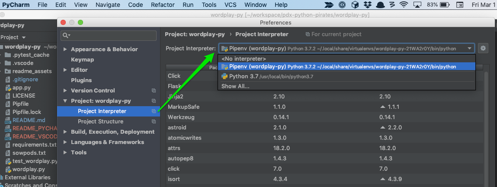
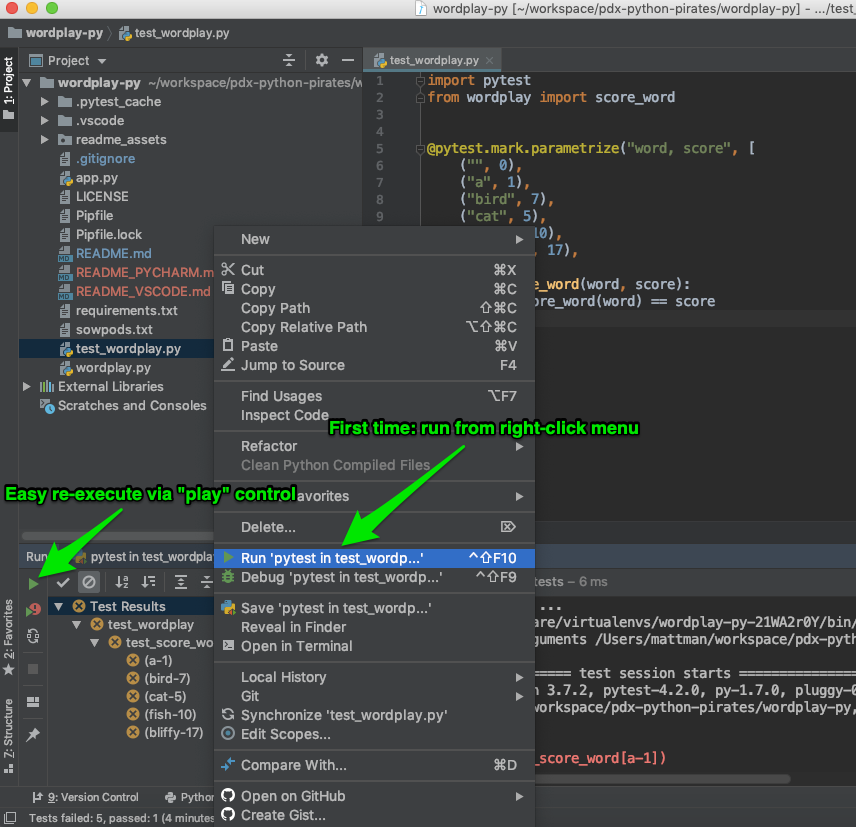
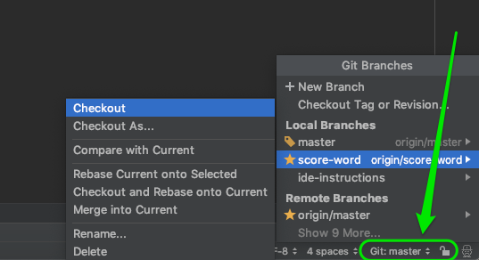

# Wordplay: PyCharm Configuration

Additional PyCharm instructions that accompany the [Wordplay mini project](https://github.com/PDXPythonPirates/wordplay).

# Contents
- [References](#references)
- [Quick Set Up](#quick-set-up)

# References
- [PyCharm home page](https://www.jetbrains.com/pycharm/)
- [PyCharm documentation](https://www.jetbrains.com/pycharm/documentation/)

# Quick Set Up

1) PyCharm should recognize your virtual environment once it is created.  
  If not, set the project interpreter under general preferences:  
  _File > Settings > Project: wordplay > Project Interpreter_  
  (on Mac: _PyCharm > Preferences > Project: wordplay > Project Interpreter_)  
  Choose your virtual environment in the drop down list in the right hand area.  
  
2) Run `pytest` from the built in Terminal.  
  You can confirm your virtual environment is active when `(wordplay)` is displayed in the prompt.  
  _If PyCharm does not automatically activate your virtual environment, review step 1._  
  Launch the PyCharm Terminal from the bottom frame, just below the editor pane.  
  From the command prompt type and execute:  
  `pytest -v`  
3) Run `pytest` from the GUI.  
  Find the file `test_wordplay.py` in the project layout in the left hand pane.  
  Right-click and choose `Run 'pytest in test_wordp...'`  
  This will open the Test palette to display execution results and allow easy re-execution of tests via the **green play** control.  
  
3) Git branches can be managed and changed using the control in the bottom right corner.  
  

